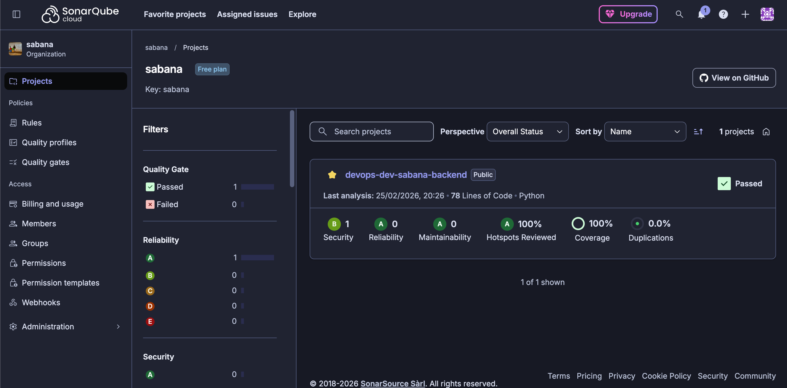

# API de Retos Sabana 🚀

API desarrollada con FastAPI para gestionar retos de programación con diferentes niveles de dificultad..

Esta arquitectura proporciona una base sólida y flexible para experimentar con retos de educación financiera, permitiendo a los equipos de sabana adoptar rápidamente prácticas modernas de desarrollo, automatización, calidad y seguridad, y escalar la solución según las necesidades reales del producto y del equipo..

## 🛠️ Arquitectura del Proyecto

```text
devops-dev-sabana-backend/
│
├── .github/
│   └── workflows/
│       └── ci-sabana.yml           # Pipeline de Integración Continua (GitHub Actions)
├── Jenkinsfile                     # Pipeline de Entrega Continua (Jenkins en Kubernetes)
├── app/
│   ├── routers/
│   │   └── challenges.py           # Rutas y lógica de negocio de los retos
│   ├── static/                     # Archivos estáticos (imágenes, favicon)
│   │   ├── sabana.png
│   │   └── sabana-logo.png
│   ├── templates/
│   │   └── index.html              # Plantilla HTML para el landing page
│   ├── config.py                   # Configuración general del proyecto
│   ├── main.py                     # Punto de entrada y registro de routers
│   └── models.py                   # Definición de modelos Pydantic
│
├── tests/
│   ├── __init__.py
│   ├── test_challenges.py          # Pruebas automáticas de la API
│   └── test_main.py
│
├── Dockerfile                      # Imagen de contenedor reproducible
├── requirements.txt                # Dependencias de Python
├── pytest.ini                      # Configuración de pruebas
├── sonar-project.properties        # Configuración para análisis de calidad (Sonar)
└── README.md                       # Descripción y guía del proyecto
```

## 📋 Estructura del Proyecto

- API lista para experimentación:
Expone endpoints para publicar, consultar y gestionar retos de educación financiera, alineándose con el propósito de la iniciativa sabana.


- Arquitectura modular y escalable:
La separación en módulos permite agregar nuevas funcionalidades (más rutas, seguridad, autenticación) de forma sencilla.


- Pruebas y calidad:
Incluye pruebas automáticas y configuración para análisis de calidad, asegurando robustez y facilitando la experimentación continua.


- Automatización y despliegue:
Listo para ser dockerizado y desplegado en cualquier entorno cloud, integrable fácilmente a pipelines CI/CD.


- Buenas prácticas de seguridad:
Facilita la integración de autenticación, control de acceso y prácticas de seguridad desde el diseño.


- Documentación interactiva:
Ofrece documentación automática y clara (Swagger UI y Redoc) para desarrolladores.

- Validación de Calidad (CI): Orquestador en la nube encargado de ejecutar la suite de pruebas unitarias (pytest), verificar la cobertura de código y realizar el análisis estático de seguridad (SAST) mediante SonarCloud. Una vez validado, emite la señal de disparo (Trigger) hacia el entorno local.

- Despliegue y Distribución (CD): Orquestador local ejecutado sobre Minikube. Gestiona agentes dinámicos en Kubernetes para la construcción inmutable de la imagen Docker y su posterior publicación en el registro oficial de Docker Hub tras la aprobación del Quality Gate.

## 🚀 Cómo Ejecutar

### 🔧 Requisitos Previos
- Python 3.11+
- Docker
- pip

### 🏃 Ejecución Local

1. **Configurar entorno virtual**:
   ```bash
   python -m venv venv
   source venv/bin/activate  # Linux/Mac
   # venv\Scripts\activate   # Windows
    ```
2. **Instalar dependencias:**:
   ```bash
   pip install -r requirements.txt
   ```
3. **Ejecutar la API:**:
   ```bash
   uvicorn app.main:app --reload
    ```
4. **Acceder a la API::**:
- Documentación Swagger: http://localhost:9000/docs
- Redoc: http://localhost:9000/redoc
##  🐳 Ejecución con Docker
1. **Construir la imagen:**
   ```bash
   docker build -t sabana-api .
   ```
2. **Ejecutar el contenedor:**
   ```bash
    docker run -p 9000:9000 sabana-api
    ```
   **Opciones útiles:**
-  -d para ejecutar en segundo plano
- --name sabana para nombrar el contenedor

##  🧪 Ejecución de Tests
1. **Tests normales:**
   ```bash
   pytest -v tests/
    ```
2. **Tests con cobertura:**
    ```bash
    pytest --cov=app tests/
     ```
3. **Generar reporte HTML:**
   ```bash
   pytest --cov=app --cov-report=html
    open htmlcov/index.html  # Ver reporte
    ```
##  📚 Documentación de Endpoints
GET
- Devuelve un mensaje de bienvenida
- Ejemplo de respuesta:
    ```bash
    {"Hello": "World"} # Ver reporte
    ```

    GET /health
- Health check de la API
- Respuesta esperada:
    ```bash
    {"status": "ok"}
    ```
  GET /challenges
- Lista todos los retos creados
  - Ejemplo de respuesta:
      ```bash
      [
    {
      "title": "Ahorrar 10%",
      "description": "Ahorro mensual",
      "difficulty": "intermedio"
    }
      ]
      ```
  POST /challenges
- Crea un nuevo reto
- Body requerido:
    ```json
    {
  "title": "string",
  "description": "string",
  "difficulty": "básico|intermedio|avanzado"
    }
    ```
- Código de respuesta: 201 (Created)
  
## 🔍 Validaciones

La API valida automáticamente:

- Que el campo difficulty sea uno de los valores permitidos

- Que todos los campos requeridos estén presentes

- Tipos de datos correctos

## 🛠️ Tecnologías Utilizadas

- FastAPI - Framework web
- Pydantic - Validación de datos
- Uvicorn - Servidor ASGI
- pytest - Testing framework
- Docker - Contenerización

## 📊 Estructura del Código
El archivo principal main.py contiene:

1. Configuración inicial:

   - Creación de la app FastAPI
   - Configuración de logging


2. Modelos Pydantic:

   - Challenge: Modelo principal para los retos
   - DifficultyLevel: Enum para los niveles de dificultad


3. Endpoints:

   - Rutas principales con sus funciones

   
4. Almacenamiento:

    - Lista en memoria challenges que persiste durante la ejecución

## 🔄 Flujo CI/CD (Integración y Entrega Continua)

El proyecto cuenta con dos pipelines automatizados que garantizan la calidad del código y su despliegue inmutable:

### 1. Integración Continua (CI) con GitHub Actions
El archivo `.github/workflows/ci-sabana.yml` se dispara automáticamente ante cada `push` o `pull_request` a la rama `main`.
* **Checkout & Setup:** Prepara el entorno Ubuntu e instala Python 3.11.9.
* **Dependencias & Testing:** Instala las librerías necesarias y ejecuta pruebas unitarias usando `pytest` con reporte de cobertura.
* **Análisis de Calidad:** Envía los resultados a SonarCloud para evaluar vulnerabilidades y deuda técnica.
* **Trigger CD:** Si todas las etapas anteriores son exitosas, realiza una petición webhook a Jenkins para iniciar el despliegue.

*(Insertar aquí captura de pantalla de GitHub Actions en verde)*

### 2. Entrega Continua (CD) con Jenkins
El archivo `Jenkinsfile` es orquestado localmente usando agentes dinámicos en Kubernetes. Consta de los siguientes stages:
* **Docker Build:** Utiliza un contenedor con el cliente de Docker anidado para construir la imagen de la API (`sabana-api`) basándose en el `Dockerfile`.
* **Push to DockerHub:** Autentica de forma segura y sube la imagen al registro público etiquetada con el `BUILD_NUMBER` y `latest`.
* **GitOps Sync:** Clona el repositorio de manifiestos de Kubernetes y actualiza dinámicamente el `values.yaml` del chart de Helm con el nuevo tag de la imagen, disparando la actualización en el clúster.

## 🧪 Aseguramiento de la Calidad y Automatización de Pruebas

Para garantizar la confiabilidad, mantenibilidad y el correcto funcionamiento del sistema, este proyecto adopta rigurosas prácticas de ingeniería de software para la verificación y validación, cumpliendo con los estándares de la Maestría en Arquitectura de Software.

### Metodología de Desarrollo Dirigido por Pruebas (TDD)
El desarrollo de los componentes (modelos, rutas y lógica de negocio) se guió por el ciclo de Desarrollo Dirigido por Pruebas (TDD). Esta práctica, fundamentada por autores clásicos de la ingeniería de software (Beck, 2003), asegura que el código sea testeable desde su concepción mediante iteraciones cortas:
1. **Red:** Escritura de la prueba unitaria (fallida) definiendo el comportamiento esperado y los criterios de aceptación.
2. **Green:** Implementación del código funcional mínimo necesario para superar la aserción de la prueba.
3. **Refactor:** Optimización de la lógica del código garantizando el cumplimiento del *Quality Gate* y la mitigación de deuda técnica, manteniendo las pruebas en estado exitoso.

Además, el diseño de los casos de prueba automatizados implementa el patrón de arquitectura de pruebas **AAA (Arrange, Act, Assert)** y el framework de comportamiento explícito **Given-When-Then**, asegurando que los *scripts* actúen como documentación viva, estructurada y comprensible del sistema.

### Matriz de Trazabilidad
A continuación, se presenta la trazabilidad directa entre los componentes de la arquitectura, los requerimientos evaluados y los escenarios de prueba:

| ID | Componente Base | Funcionalidad Evaluada | Framework | Estado | Cobertura |
| :--- | :--- | :--- | :--- | :--- | :--- |
| **TU-01** | `models.py` | Instanciación y validación estricta de tipos Pydantic (control de campos faltantes y tipado erróneo). | Pytest | ✅ Exitoso | 100% |
| **TU-02** | `main.py` | Configuración de inicialización, Health Check y validación de carga de recursos estáticos. | Pytest | ✅ Exitoso | 100% |
| **TU-03** | `routers/challenges.py` | CRUD lógico de retos financieros (Creación, Listado, y Manejo de Excepciones HTTP 422). | Pytest / TestClient | ✅ Exitoso | 100% |

### Métricas de Cobertura y Evidencias de Ejecución
El proyecto cuenta con un **100% de cobertura de código (Coverage)**, superando ampliamente el umbral mínimo exigido del 75% para estándares de calidad *Enterprise*. El análisis de código estático (SAST) y la medición exhaustiva se integran de forma continua a través de **SonarCloud**.

**Interpretación Analítica:**
Un 100% de cobertura de sentencias (*Statement Coverage*) y ramificaciones (*Branch Coverage*) mitiga drásticamente los riesgos de regresión durante la integración continua. Esto garantiza que tanto los flujos principales (caminos felices) como los flujos de error (validaciones de Pydantic y *DifficultyLevel*) estén protegidos estructuralmente ante futuras refactorizaciones.

**Evidencia de Integración Continua y Quality Gate:**


## Arquitectura de Software — Universidad de La Sabana]\ — 2025


